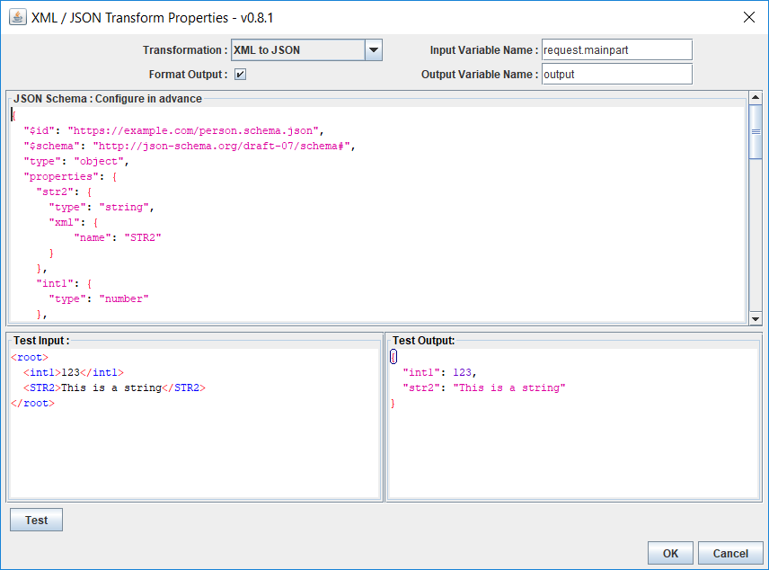

## XML-JSON Transform

This assertion transforms XML / JSON based on JSON schema included in the swagger document. This document contains XML hints that adds more capability. For more information:
* introduction: https://swagger.io/docs/specification/data-models/representing-xml/
* specifications: https://swagger.io/specification/#xmlObject

The assertion supports:
* schema caching
* $ref, which shall point to the definitions section
* for XML to JSON: if an empty non wrapped array (hence no XML element) creates an empty JSON array

_Schema caching_ is controlled with the 3 following cluster properties. Every 5 minutes these properties are refreshed:
* jsonxml.schemaCache.maxAge (in ms): entries older than this age are flushed. Set to -1 to avoid cache flush. Default is -1
* jsonxml.schemaCache.maxDownloadSize (in characters). Default is 128KB
* jsonxml.schemaCache.maxEntries. Set to 0 to avoid cache. Default is 128

Release History

|Version|Date|Details|
|---|---|---|
|0.8.0|28-Oct-18|Support for XML to JSON|
|0.8.1|4-Nov-18|Syntax highlighting optimize code for xpath (used when raising exception)|
|0.9.0|8-Nov-18|JSON to XML implemented|

TODO (by order of priority):
* JSON to XML
* additionalProperties support:
  * true or false
* ability to control for XML to JSON if an empty XML non wrapped array (hence no XML element) creates an empty JSON array
* ability to control for XML to JSON space trim for string content (text node) and XML attributes (quote delimited)
* Support for const without type
* additionalProperties support:
  * with schema
* Support schema oneOf, anyOf, allOf, not
* support for $ref
  * a definitions in schema is just a proxy to another schema in definitions
  * support relative URI
  * external $ref
